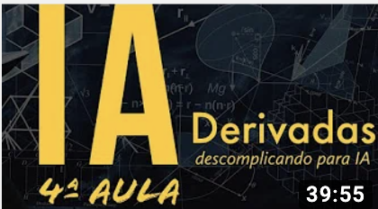

# Derivates - Artificial Intelligence Course
4th lesson of the Artificial Intelligence Crash Course for all 
By Diogo Cortiz (TIDD/PUC-SP) 

Theoretical class 

In this class, he presents the concepts of derivatives in an intuitive and focused way for the Machine Learning area.  
He shows how to calculate partial derivatives, power rule and chain rule. 
These are the fundamentals necessary to understand the next class of the course, on Descending Gradient. 

[video_at_youtube](https://www.youtube.com/watch?v=WuPKvp_-X7Y&t=2s)