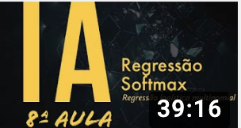

#  Softmax Regression - Artificial Intelligence Course
8th lesson of the Artificial Intelligence Crash Course for all 
By Diogo Cortiz (TIDD/PUC-SP) 

- Theoretical class 

This video shows the intuition and mathematics involved in Softmax Regression, also called Multinomial Logistic Regression, a generalization of Logistic Regression to work with more than two classes in Machine Learning. 
This video also shows the Softmax cost function, in addition to its implementation in Pytorch.

[video_at_youtube](https://www.youtube.com/watch?v=fPPy0Q5znS8&t=2s)

- Hands-on: Implementation of Softmax Regression using the Pytorch framework 
 