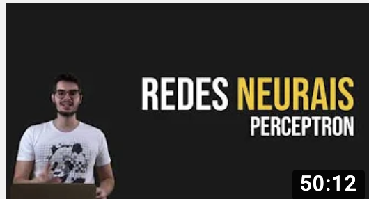
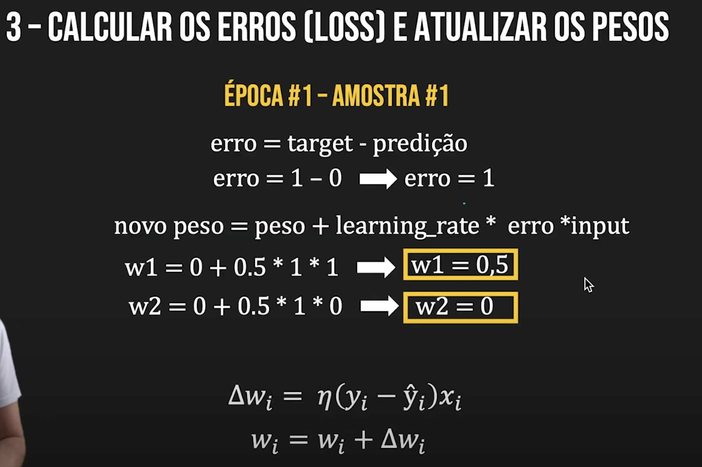
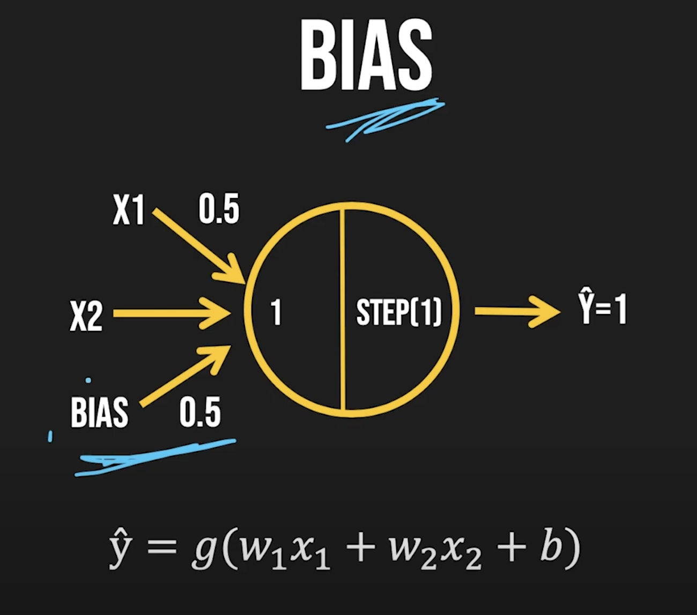

#  Neural Networks, Perceptron - Artificial Intelligence Course
9th lesson of the Artificial Intelligence Crash Course for all 
By Diogo Cortiz (TIDD/PUC-SP) 

- Theoretical class 

The video shows a little of the history of neural networks and explains how to model Perceptron, one of the first artificial neuron projects that paved the way so that now, decades later, we can have extremely complex models of neural networks. 

[video_at_youtube](https://www.youtube.com/watch?v=fEukSrpDPH0&t=2s)

 
Perceptron: 
features (input) * their weights, sum features with weight, apply a activation fuction, have the prediction (output). 
 
step = the most simple activation function 
if > 0 then 1 
if <= 0 then 0 
 
y = real value 
y_hat = prediciton of the model 
 
Recipe: 
1- start with a supervised data set (with lables) 
2- feed forward (predictions) 
3- calculate the loss and update the weights 
4- repeat 2 and 3 for each feature (datapoint)(= perceptron rule) 

Concepts:
- Epoch: repetitions. 
- Dimension of the batch: number of examples in a training in a batch (before the model update the weights). 
- Interactions: number of bacht processment by the algorithm. 
- Bias: aditional weight.  

 

 

Limitations: 
Does not work well when they are not linearly separated. 

BOOK: Perceptrons, Marwon L. Minsky 