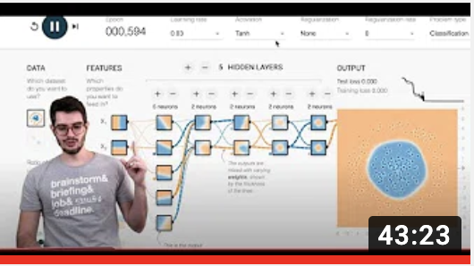

#  Neural Networks, Multilayer Perceptron - Artificial Intelligence Course
10th lesson of the Artificial Intelligence Crash Course for all 
By Diogo Cortiz (TIDD/PUC-SP) 

- Theoretical class 

The video shows how we can combine several artificial neurons to overcome Perceptron's limitations in dealing with nonlinearly separable problems.. 

[video_at_youtube](https://www.youtube.com/watch?v=0eQ6-6A5W6I)

