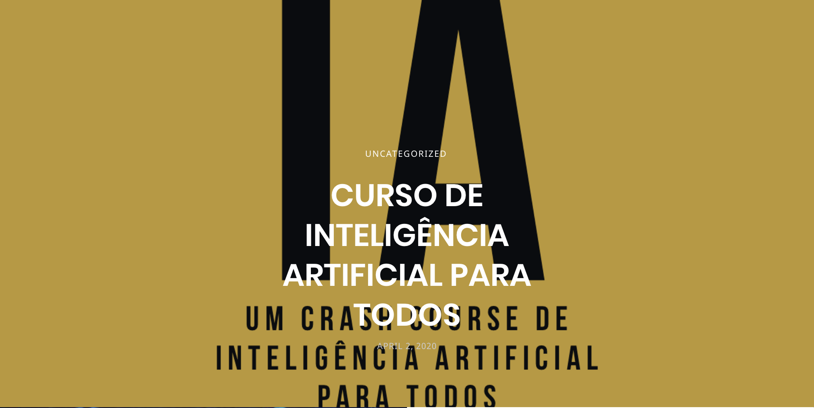

    

# Artificial Intenligence
Based on the IA course of the professor Diogo Cortiz (in Portuguese)   
[Videos at Youtube](https://www.youtube.com/channel/UC5MXrSUoLW0JRd2j7q1ef7Q)

# Table of Contents
## Lessons
1. [Introduction](01-Introduction)
2. [Linear Regression](02-LinearRegression): ficticious datasets
3. [Decision Tree](03-DecisionTree): AI-covid19-AlbertEinstein
4. [Derivatives](04-Derivates)
5. [GradientDescendent](05-GradientDescendent)
6. [EntropyAndCrossEntropy](06-EntropyAndCrossEntropy)
7. [LogisticRegression](07-LogisticRegression)
8. [SoftmaxRegression](08-SoftmaxRegression)
9. [NeuralNetworks](09-NeuralNetworks)
10. [NeuralNetworks-MultilayerPerceptron](10-NeuralNetworks-MultilayerPerceptron)

## Install the requirements
`pip install -r /path/to/requirements.txt`

### Other sources used
- [Download files with Python](https://stackabuse.com/download-files-with-python/)  
- [The Hitchhiker's Guide to Machine Learning in Python](https://www.linkedin.com/pulse/hitchhikers-guide-machine-learning-python-conor-dewey/)   
- [Plot a Confusion Matrix](https://www.kaggle.com/grfiv4/plot-a-confusion-matrix)  
- [Logistic Regression using Python (scikit-learn)](https://towardsdatascience.com/logistic-regression-using-python-sklearn-numpy-mnist-handwriting-recognition-matplotlib-a6b31e2b166a) 
- [Anscombe's_quartet](https://en.wikipedia.org/wiki/Anscombe's_quartet) 
