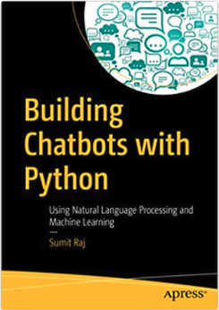

| Book | Websites |
|:-------------------------:|:-------------------------:|
| |   |

## Learning to build Chatbots
### A sandbox with examples of chatbots tutorials and book.

### Table of Contents
- EchoBot (from [Datacamp](https://campus.datacamp.com/courses/building-chatbots-in-python/chatbots-101?ex=2))
- Elisa (from DataCamp and [this repository](https://github.com/kwpark23/CourseBot/blob/1e07bbfa298b1db05c3160a499eedd48d02bbfae/eliza.py))
- Chitchat (from [DataCamp](https://campus.datacamp.com/courses/building-chatbots-in-python/chatbots-101?ex=5))
- addingVariety (from [DataCamp](https://campus.datacamp.com/courses/building-chatbots-in-python/chatbots-101?ex=6))

## Installation
[`pip install -r /path/to/requirements.txt`]

## Tools
- Python 3.7 
- Jupyter Notebook 
- Google colab

## Sources
- Book: An Introduction to Statistical Learning. Gareth James, Daniela Witten, Trevor Hastie, Robert 
- [https://campus.datacamp.com/courses/building-chatbots-in-python/chatbots-101?ex=1](https://campus.datacamp.com/courses/building-chatbots-in-python/chatbots-101?ex=1)
- [https://code.sololearn.com/chAYGq7gEQrS/?ref=app#py](https://code.sololearn.com/chAYGq7gEQrS/?ref=app#py) 
- [https://www.sololearn.com/Discuss/2133553/python-help](https://www.sololearn.com/Discuss/2133553/python-help) 

