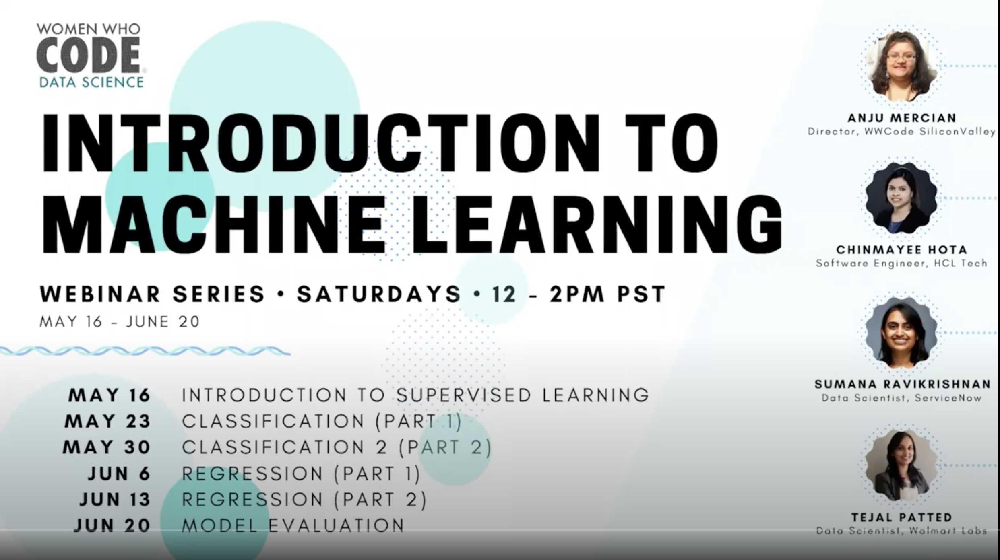

    

# MachineLearningWWC  (IN DEVELOPMENT)
Serie of Machine Learning courses   
by Sumana Ravikrishnan 
Women Who Code - Data Science  

## Contents:
- [Introdruction to supervisioned learning](https://www.youtube.com/watch?v=HanI00s8NLQ&feature=youtu.be)
- [Classification (part1)](https://www.youtube.com/watch?v=DXG07IJLnf0&feature=youtu.be)
- [Classification (part2)](https://www.youtube.com/watch?v=SpaWs71yFZ4&list=PLVcEZG2JPVhfK8MnBqcxAzwMIfpH0XpX9&index=7&t=0s)
- [Regression (part1)](https://www.youtube.com/watch?v=pl5VNmO9a4g&list=PLVcEZG2JPVhfK8MnBqcxAzwMIfpH0XpX9&index=7&t=3s): dataset "Hotel booking demand", from [Kaggle](https://www.kaggle.com/jessemostipak/hotel-booking-demand)
- [Regression (part2)](https://www.youtube.com/watch?v=kI6UgBdzgiQ&list=PLVcEZG2JPVhfK8MnBqcxAzwMIfpH0XpX9&index=8)  dataset: HousingPricePrediction
- Model Evaluation

## Tools
- Google Colab
- Python 3.7

## other references

[cross validations](https://www.youtube.com/watch?v=7062skdX05Y)
[Artificial Intelligence - All in One](https://www.youtube.com/channel/UC5zx8Owijmv-bbhAK6Z9apg)