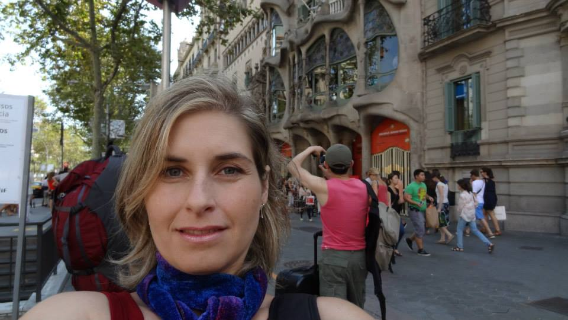

# My vacation preferences

## Purpose
### Jupyter Notebook - Lab - day1 - Data Analytics Ironhack Bootcamp Berlin (2021)

## Index
1. **Who I am**
2. *My picture*
3. **My preferred destination for holidays**
4. *Me in Barcelona*
5. What I like to do there

My name is **Karina Condeixa**

**My preferred destination for my holidays is *Barcelona*.**

At Barcelona, I love to:

   - [apreciate Gaudí's architecture](https://www.youtube.com/watch?v=h0Gm3dI0X_s)
    
   - [eat tapas](https://www.youtube.com/watch?v=XUrgblWBVig)
    
   - [drink cañas](https://www.youtube.com/watch?v=fOuc4GEkfF4)
  

