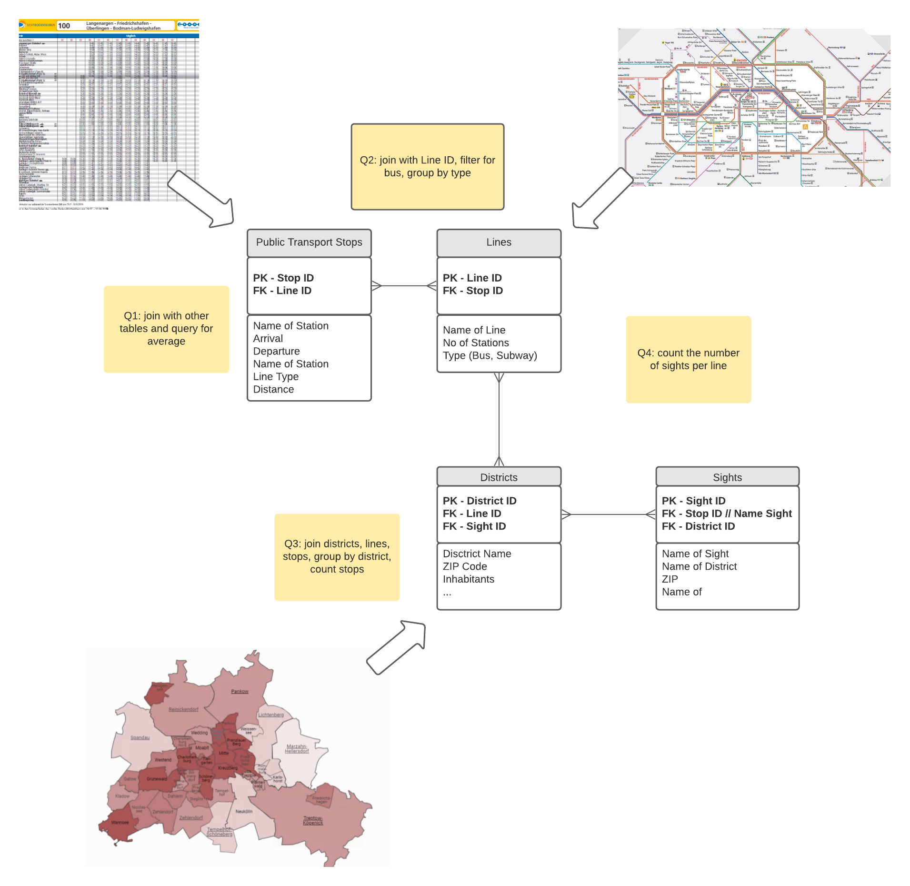

# SQL
Week 3 of the Data Analytics Bootcamp Ironhack.

### Day 1 - SQL Intro
- [class](https://github.com/KC2016/SQL-queries/tree/main/Ironhack/classes/day1-SQL-sakila)

- [lab](https://github.com/KC2016/SQL-queries/tree/main/Ironhack/labs/lab_day1-SQL-sakila)

Sakila database of movie rentals

### Day 2 - queries
- [class](https://github.com/KC2016/SQL-queries/tree/main/Ironhack/classes/day2_SQL)

- [lab](https://github.com/KC2016/SQL-queries/tree/main/Ironhack/labs/lab_day2_SQL)

### Day 3 - agg, where, having
- [class](https://github.com/KC2016/SQL-queries/tree/main/Ironhack/classes/day3-SQL-aggs_where_having)

- [lab](https://github.com/KC2016/SQL-queries/tree/main/Ironhack/labs/lab_day3_aggs_where_having)

### Day 4 - joins

- [class](https://github.com/KC2016/SQL-queries/tree/main/Ironhack/classes/day4-sql_joins)

- [lab](https://github.com/KC2016/SQL-queries/tree/main/Ironhack/labs/lab_day4_SQL_joins)

### Day 5 - subqueries

### [Project - ERD](https://github.com/KC2016/SQL-queries/tree/main/Ironhack/labs/project_ERD)
Quick task: Create a conceptual ERD schema based on a business case study. 
**Team:** Karina | Jerrit | Lilla | Tony

