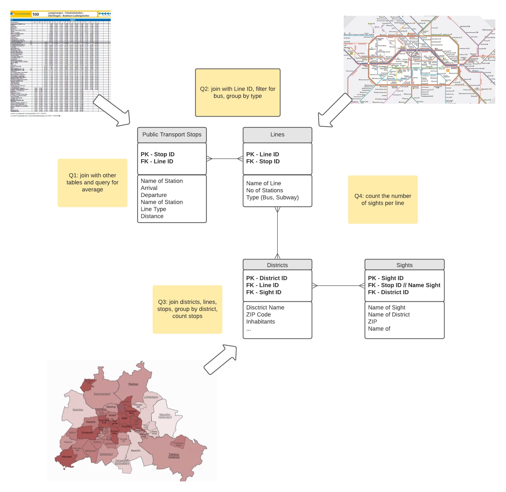

## Welcome to your first time boxed conceptual challenge!

### Guidance:

* Prepare yourselves - the hardest element of this task will be understanding the task and creating something presentable, quickly.
* You will join up with other students in small groups of between 3 and 5 students, or if you prefer you can work alone.
* You will be given just 60-90 minutes during class hours to discuss this as a group and formulate your response to this scenario.
* You will nominate spokesperson(s) from your group to present what you have developed with your classmates
* We would like ALL students to upload the link to the presentation materials to the student portal this week (hint: you might need to create a tidy Readme in one of your github repositories!)
* You do not have to actually build a database, just sketch one out - either on paper, or using an online tool.

### Scenario :
* You are a data analyst at a company called Gettoknowaplace which offers personalised recommendations to newcomers in big cities, based on paid for research topics.

* Your manager has given your team the following task and wants you to present back an initial proposal at your next meeting this afternoon: for a database schema (a conceptual entity relationship diagram) which would store the relevant data for your chosen topic - it is important that the design is both logical and easy to query as another team in your company will design the query layer between the customer web application and the database.

* Your case study customer is in her 30s and has recently relocated to the city of Berlin. Each group will select one of the topics from the below list; each topic includes some sample questions (appropriate to a traditional relational database structure) and a fluffier, unstructured question (U:) which might require more imagination to resolve.

#### Outcomes:

* a group presentation to class of no more than 5 minutes including presenting the following...
* a conceptual 'ERD' which illustrates the sources and tables, relationships (think about 1:M cardinality/relationships), names of fields/entities, defined primary and foreign keys - this should be a shareable as a pdf, png/jpeg, can be hand-drawn and captured by photograph/scanning or created with software such as Visio/LucidChart. Think about how easy the diagram is for others to understand and be prepared to clarify any terminology and concepts during a Q&A. Remember this is conceptual, so you do not need to confirm whether these data sources actually exist, but you may have some suggested sources.
* an illustrative description of the unstructured data sources/ types and processes you would seek to include in your model plus specific examples of how this U: data could enhance and link into your relational/structured data. Remember this is conceptual, so it is not important whether these sources of data are actually accessible to you, although if you find some examples of what you would like to do that would be great to see.
* a verbal summary of the collaborative process, how the group dynamic was, what you found difficult, easy or interesting, did you go down any 'rabbit holes' and how well you feel you met the task together
* any next steps you identified during the process or anything you would do differently next time

## TOPICS and example QUESTIONS

### Transportation

* 1. whats the average u bahn journey time between any two stations?
* 2. which bus route has the most stops?
* 3. are there parts of the city with more public transport options than others?
* 4. U: which routes are the more pleasant and /or scenic?

### Restaurants

* 1. which parts of the city have the most restaurants per sq km?
* 2. where can a vegan burger restaurant be found, with an opening time filter eg customer wants to visit on thursday at 6pm?
* 3. how many Vietnamese restaurants are there in Berlin?
* 4. U: which restaurants are good for big groups?

### Entertainment

* 1. where are the biggest theatres in Berlin?
* 2. how many cinemas are there? and what type are they? eg independent, chain, art-house
* 3. which art galleries are open on Sundays?
* 4. U: is the danceclub scene in Berlin growing or contracting?

#### - for tips on how to design an ERD, what symbols and connectors to use :

* https://www.smartdraw.com/entity-relationship-diagram

* https://www.guru99.com/er-diagram-tutorial-dbms.html

* https://www.visual-paradigm.com/support/documents/vpuserguide/3563/3564/85378_conceptual,l.html

* you should be able to find tutorials on how to build an ERD in whichever visual tool you choose - heres the one for LucidChart  https://www.youtube.com/watch?v=QpdhBUYk7Kk

## Conceptual ERD schema
### Team: 
Karina 
Jerrit 
Lilla  
Tony 

[Source](https://lucid.app/lucidchart/a7151692-7f89-4c19-aaf3-2ce85c3862bc/edit?page=0_0#)