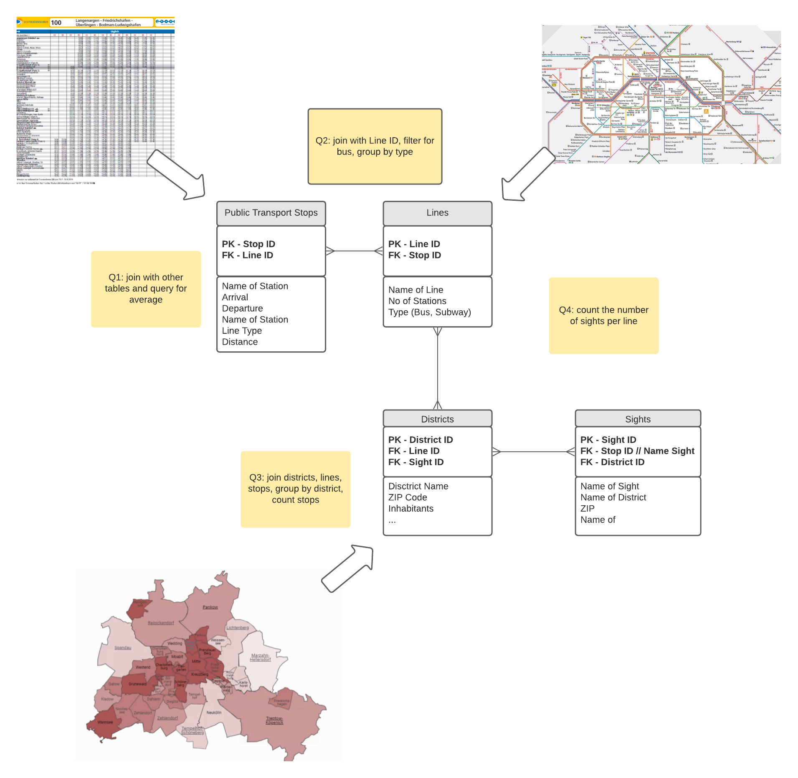

# SQL
Week 3 of the Data Analytics Bootcamp Ironhack. 
Hands-on tasks at classes and labs.

### Day 1 - SQL Intro
Sakila database of movie rentals

### Day 2 - select, from , where, group by, order by, max, insert into, alter table, drop column

### Day 3 - agg, where, having

### Day 4 - joins

### Day 5 - subqueries - SQL with Python

### [Project - ERD](https://github.com/KC2016/SQL-queries/tree/main/Ironhack/labs/project_ERD)
Quick task: Create a conceptual ERD schema based on a business case study. 
**Team:** Karina | Jerrit | Lilla | Tony

