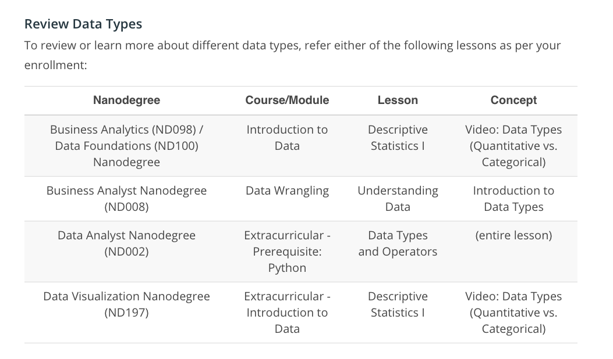

# Data Visualization with Tableau, Udacity
# Lesson 1
## Introduction to Data Visualization
dataset: product-data.xlsx 

## Data types
### Quantitative 
#### Discreate (countable, separate values)
- Represented in blue
- Scratches (cat)
#### Continuous (measurable, in a range)
- Represented in green
- height
- life expectancy
- spending per person

### Qualitative
#### Categorical
- Sex
- "Has Universal Healthcare"
#### Ordinal
- Doctor visit per year

## What graph to use for:
### Quantitative data
- **Histogram (the most common): for univariate plots, ex:frequency**
- Normal Quantile Plot
- Stem and Leaf Plot
- Box and Whisker Plot  
**Comparing two quantitative variables**
- Scatter plots (the most common)
- correlation coefiicient (r)  
- Pearson's correlaion coefficient: linear correlations between two variables x ad y. It's values are between -1 and +1, inclusively.
- Spearman's rank correlation coefficient: nonparametric function that considers r = 1 identical and r = -1 the fully opposed. 
- positive  with an increasing monotonic trend
between X and Y (/ at the graph),  a decreasing monotonic trend (\ at the graph)    and 
between X and Y.
- Strenght: strong (0.7<=|r|<1.0), moderate (0.3<=|r|<0.7), weak (0.0<=|r|<0.3)
- Direction: positive, negative
- Correlatiobn coefficient: between -1 and 1  
**References:** 
- https://video.udacity-data.com/topher/2019/November/5dcb372a_statistics-solutions/statistics-solutions.pdf
- https://video.udacity-data.com/topher/2019/November/5dcb373d_pearson-correlation-/pearson-correlation-.pdf
- https://video.udacity-data.com/topher/2019/November/5dcb374d_spearmans-coefficient-/spearmans-coefficient-.pdf

### Qualitative categorical data
- **Bar Chart (the most common)**
- Pie Chart
- Pareto Chart

Video about introduction toData Dashboard: https://video.udacity-data.com/topher/2019/November/5dcb20b4_hans-roslings-200-countries-200-years-4-minutes/hans-roslings-200-countries-200-years-4-minutes.pdf)

# Lesson 2
## Design
dataset: two-stories-data.xlsx

### Steps
1- Understand the context 
2- Choose an appropriate visual display 
3- Eliminate clutter 
4- Focus attention where you want it 
5- Think like a designer 
6- Tell a story 

### Proposes
**Exploratory**: to find answers 
**Explanatory**: to tell the story  

### Steps pf Data Analysis
Extract, clean, explore, analyse, and share

How to lie with statistics: http://faculty.neu.edu.cn/cc/zhangyf/papers/How-to-Lie-with-Statistics.pdf

### Avoid chart junk, such as:
- Heavy grid lines
- Unnecessary text
- Pictures surrounding the visual
- Shading or 3d components
- Ornamented chart axes
- data-ink ratio

### Design Integrity Notes
Visual aspects must be proportional to the data
lie factor = (variation visual/visual start)/(variation of data/data start)
being start = smaller 
How to spot viz lies: https://video.udacity-data.com/topher/2019/November/5dc4a59c_how-to-spot-visualization-lies-flowingdata/how-to-spot-visualization-lies-flowingdata.pdf

### Tips for using color effectively.

1- Start with black and white. 
2- When using color, use less intense colors. 
3- Use color only to highlight your message and separate groups of interest. 

Reference about colors: https://www.tableau.com/about/blog/2016/4/examining-data-viz-rules-dont-use-red-green-together-53463

- Recommendation: use colors on a blue to orange palette

### Additional Encodings (non x or y)
- For categorical variables: color and shapes.
- For quantitative data: size of marker.
- Do not overuse! It might be better to break the information into multiple individual messages. 
- Simplicity, integrity

### Bad visuals can be avoided by:
1- Maintaining a large data-ink ratio and removing unnecessary items from visuals. 
2- Choosing visual encodings that work to highlight insights. 
3- Maintaining data Integrity in the visual. 

### For explanatory visuals:
1- Focus the audience's attention on the insight you want them to act on. 
2- Use color only when necessary. Simple is often better. 
3- Tell a story.

### Results
1- Question 
2- Repitition (to memory) 
3- Highlight the answer 
4- Call the Audience to Action 

# Lesson 3
## Data Visualizations in Tableau
dataset: global-superstore.xlsx 

## Topics Covered
I. Connecting to Data 
II. Combining Data 
III. Worksheets 
IV. Aggregations 
V. Hierarchies 
VI. Marks & Filters 
VII. Show Me 
VIII. Small Multiples & Dual Axis 
IX. Groups & Sets 
X. Calculated Fields 
XI. Table Calculations 
Final Thoughts 

### * Commas vs. Periods in Different Countries
Depeding of the workbook locale, we can have point as separator of thousands and comma of decimals or vice versa. 

## I. Connecting to data
Public Tableau, which I am using, has 
few resources in comparison with the paid versions. 
I am connecting with Excel.

### Main basic commandas
- to change data types
- split columns
- view data

## II. Combining data
- **Union of tables:** combine two sheets stacked on top of one another that have all the same columns.
- Join tables (inner is the default)

### Description of keys (an example)
- **primary key:** Region (People)
- **foreign key:** Region

## III. The main products we can create using Tableau:
1- Worksheets: viz 
2- Dashboards: communication 
3- Stories: combination of worksheets and dashboards 

### NOTE: 
- Tableau calls categorical data types Dimensions, while it calls quantitative data Measures.

## IV. Agrregation and granularity
- Aggregation = sum(variables in row and column)
- granularity = categorical variables as colors, shape, labels, detail

## To calculate the number of records
- click at the arrow close to the search
- click "Create Calculated Field"
- Type 1 at number of records

## Saving as Public Tableau
It is needed to create a count to save the work. Using the paid version, we can save it in ower machine.

## Exploring data
- jumping into
- making questions

## V. Hierarchies

Changing dates to continuous is more useful than using dates as descrete data type. 
Ex: To see in a plot years instead of months, we click at the variable, than convert to continuous, bring the variable back to the column or row.

- clicking in + we drill down seeing data divided in smaller categories (from year to quarter, than month). And vice-versa.

- we can also create categories for dates. To create a hierarchie, click Subcategory and Category (with "command", in Mac), hierarchie, create hierarchie.

## VI. Marks & Filters
To filter variables and categories we can drag to the Filters, or select in the graph and  click with the right button. 
We must click Show Filter. 

### Interactive filters
We can modify the way we control the filter in the menu on the Controls.
Tutorials: https://www.tableau.com/learn/tutorials/on-demand/using-filter-shelf

- Multiple values (drop and down)

## VII. Show Me
- The Show Me feature is a quick way to start with a basic graph which you can add to afterwards.
- To see the filter we should make a right-button click and select Show Me.

## VIII. Small Multiples & Dual Axis
 - Data have to be (converted to) continuous (green).
 ### Small Multiples
  - Simply dragging multiple dimensions to the Columns and Rows shelves creates a small multiple.
 ### Dual Axis 
 - Select one of two grapfs, click the right button and select dual axis.
 - Dual axis can be confusing to the reader.

## Groups and Sets
They are two ways that Tableu has to grouping data.

### Groups
- Are static.
- Select multiple data at the view (graph).
- Click the right button and select.
- Rename the group as we want.
- We can use this group in another map.

### Sets
- Are dynamic.
- drop down, creat, set..., condition

**NOTE: for unknow places, we must edit location.** 

## X. Calculated Fields
- Calculated fields let we create new fields to use in your visualizations.
- drop dpown, create, calculated field... (or)
- analysis, calculated field... 
- type the formula
- name it

## XI. Table Calculations
Table calculations are often used to perform comparisons of our data over time or between groups. 
Reference: https://www.tableau.com/about/blog/2019/11/top-10-tableau-table-calculations  
There are two calculations methods that can answer different questions. 
**What is the profit ratio for a single order within any product or any other category level?** 
Use Average `[Profit]/[Quantity]` 
**What is the profit ratio at any level of a category?** 
Use `SUM([Profit])/SUM([Quantity])`

### Conditional statements
`IIF(conditions, if true, if false)`  
Example:  
`IIF([Quantity] < 2, 'Low', 'High')` 
References: 
- Blog: https://video.udacity-data.com/topher/2019/November/5dc49a0e_string-calculations-in-tableau-clearly-and-simply/string-calculations-in-tableau-clearly-and-simply.htm
- Video-tutorial: https://www.tableau.com/learn/tutorials/on-demand/string-calculations
- Documentation: https://www.tableau.com/learn/tutorials/on-demand/string-calculations

## Final Thoughts
A recommendation to train and practice Tableau at: 
https://www.tableau.com/learn/training/20203

# Lesson 4: 
## Making dashboard and storytelling with Tableau.
datasets: 
- movie-metadata.csv
- asylum-seekers-monthly-2016-12-08-152150.csv
- world-cup-data.xlsx

Purposes:
1. Practice with different datasets to gain confidence. 
2. Analyse multiple datasheets (with filters) at once with dashboards. 
3. Create a new dataset. 
4. Learn about stories. 
5. Point you to some additional resources for we to continue learning. 

### Hierarchies & Filters
A remind 
To update the filter in all worksheets:
- drop down in filters, apply to the worksheets, All using related data sources

### Dashboard
- Give an overview; good for explore data.
- We can include some sheets.
- Create a new dashboard (+), drag sheets there.
- To filter all worksheets on a dashboard: 
In a dashboard, click the drop-down menu on a filter card and select Apply to Worksheets > Selected worksheets.
In the Apply Filter to Worksheets dialog box, click All on dashboard, and then click OK. 

## General Notes for Building Data Dashboards
References: 
- Samples: https://public.tableau.com/en-us/gallery/?tab=viz-of-the-day&type=viz-of-the-day 
- https://www.tableau.com/learn/tutorials/on-demand/getting-started-dashboards-and-stories
- https://www.tableau.com/learn/tutorials/on-demand/building-dashboard
- Documentation: https://help.tableau.com/current/pro/desktop/en-us/dashboards.htm

### Story
- It has a narrative in order, context, explanations.
- We can combine sheets, dashboards, captions.
- Each sheet is shown separately.
References:
- Tutorial: https://www.tableau.com/learn/tutorials/on-demand/story-points
- Documentation: https://help.tableau.com/current/pro/desktop/en-us/stories.htm

**Notes:** 
- Modifying the stories (like filter) does not change the sheet and dashboard. 
- Once we made a modification on Story, if does not update when we modify a sheet or dashboard.
- Make a duplicate of a sheet to use in a dashboard or story can be useful.
- If the sheet is hidden, we can't use it in story or dashboard.

References for solutions: 
- https://public.tableau.com/profile/josh2979#!/vizhome/GoalsbyCountry/Sheet2?publish=yes
- https://public.tableau.com/profile/josh2979#!/vizhome/GoalsbyGroup/Sheet1?publish=yes
- https://public.tableau.com/profile/josh2979#!/vizhome/Lines_13/Sheet3?publish=yes
- https://public.tableau.com/profile/josh2979#!/vizhome/DashboardSolution/Dashboard1?publish=yes

### My Tableau Public:
https://public.tableau.com/profile/karina.condeixa#!/