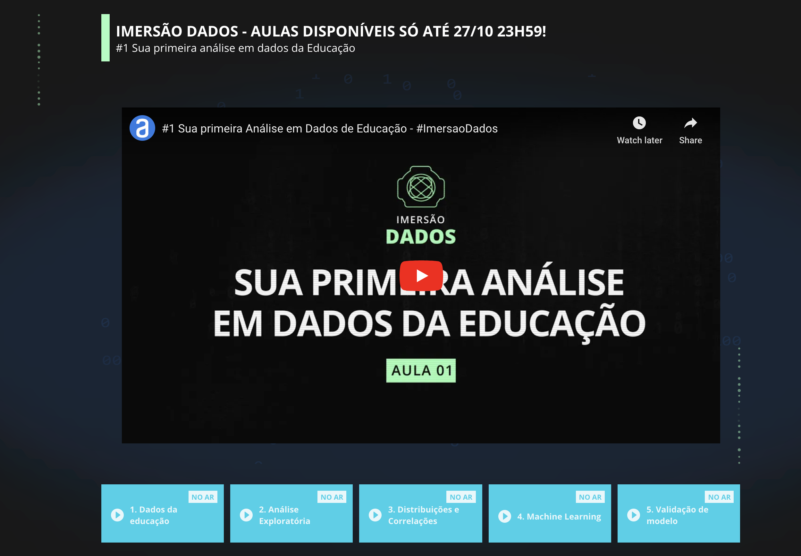

    

## Imersão de Dados

### [Alura-imersao_dados](https://www.alura.com.br/imersao-dados/aula01-educacao-no-brasil)
Mini_bootcamp de Ciência de Dados. Analisando dados do ENEM.  
[ENEM](https://github.com/alura-cursos/imersao-dados-2-2020/blob/master/MICRODADOS_ENEM_2019_SAMPLE_43278.csv)  
[dicionário de dados](https://github.com/alura-cursos/imersao-dados-2-2020/blob/master/MICRODADOS_ENEM_2019_SAMPLE_43278.csv)

### Conteúdo das aulas e lives
- Aula 1 - Dados da Educação 

- Aula 2 - Análise Exploratória

- Aula 3 - Distribuições e Correlações

- Aula 4 - Machine Learning

- Aula 5 - Validação do Modelo

- Live 1 - Carreira em Dados e Educação no Brasil

- Live 2 - Data Science no Exterior *(Participação do Flavio Clesio (https://github.com/fclesio))*

- Live 3 - Data Hackers, Storytelling e o Bootcamp Data Science Aplicada

- Live 4 - Encerramento da Imerção e Lançamento do Bootcamp - ative o lembrete!

### Recommendações sobre Storytelling e visualização de dados
- https://datahackers.com.br/podcast
- https://medium.com/data-hackers/usufruindo-de-t%C3%A9cnicas-agile-para-entregar-valor-com-dados-4a9c54704584
- https://paulovasconcellos.com.br/como-mentir-com-data-science-4881cd91fc35
- https://fivethirtyeight.com/
- https://pudding.cool/
- https://pudding.cool/

### Ferramentas usadas
- Google Colab
- Python 3

